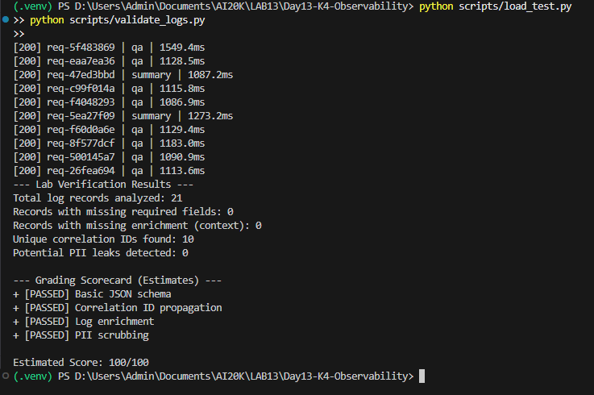
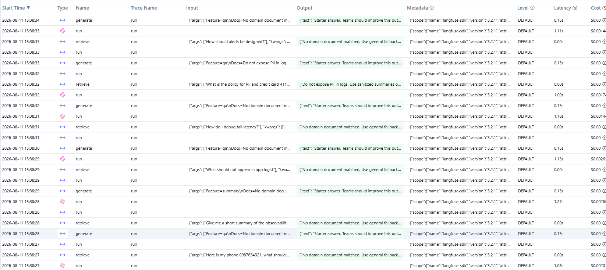
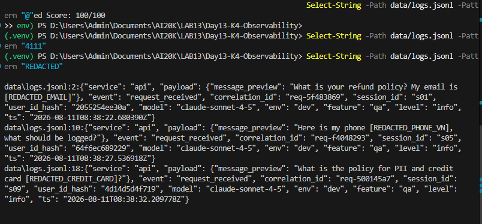
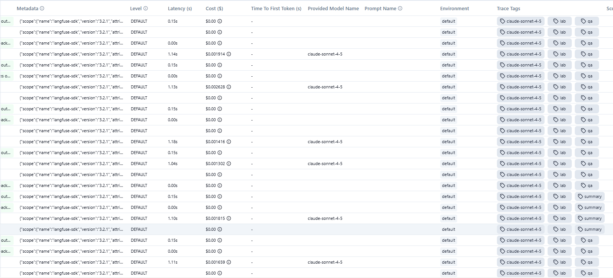
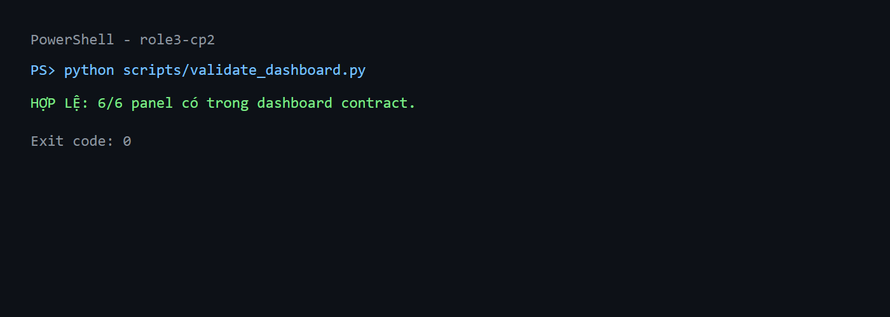
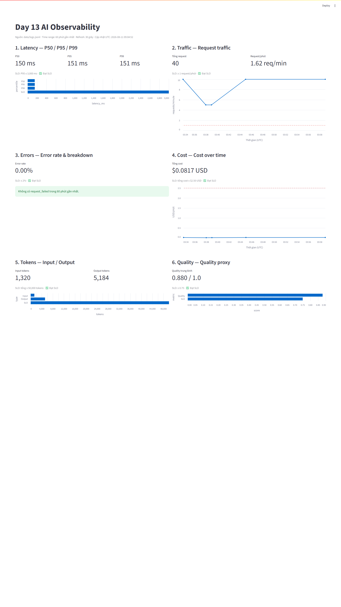
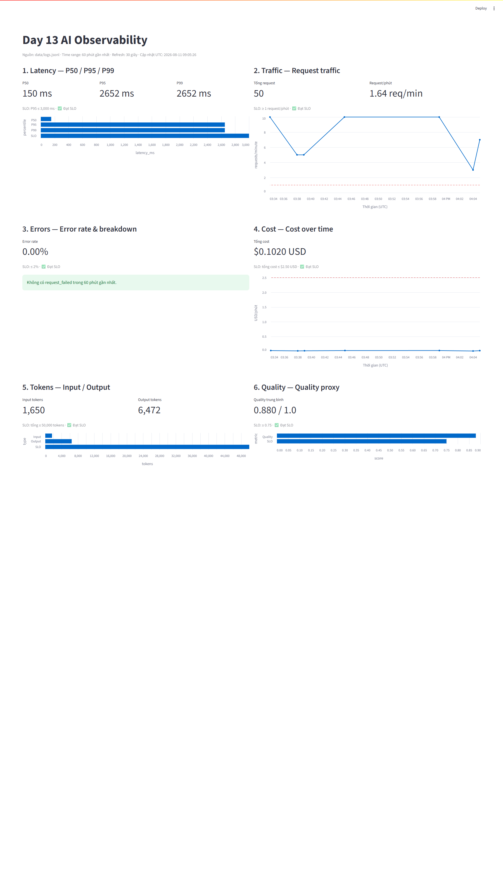
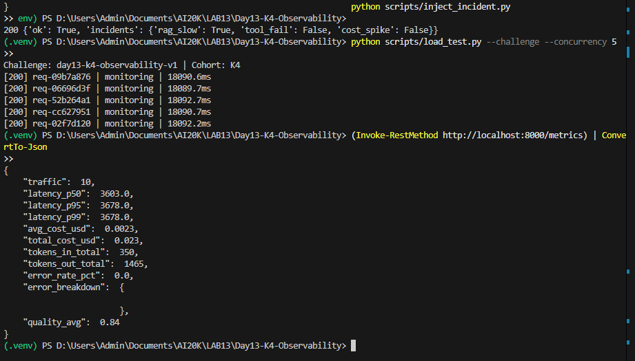

# Báo cáo Day 13 Observability

## 1. Thông tin nhóm

- Tên nhóm: J97-Sky
- Repository URL: https://github.com/phambahuycv/Day13-K4-Observability
- Commit SHA cuối: 3c96294ef9c3404a709a5112ac6277044695b0d7
- Thành viên và vai trò: 
    * Thành viên A: Đông (API & Middleware - Correlation ID & Exception Handling)
    * Thành viên B: Huy (Security Engineer - PII Scrubbing & Log Validation)
    * Thành viên C: Thành (Metrics & Dashboard - Error Rate & Dashboard Specification)
    * Thành viên D: Minh (SRE & Alerts Engineer - SLO Setup & Alert Runbook)
    * Thành viên E: Hiếu (QA & Chief Investigator - Load Testing, Tracing, Incident RCA & Final Report)

## 2. Kết quả kỹ thuật

- Điểm `validate_logs.py`: **100/100** (Đạt chuẩn JSON schema, Correlation ID propagation, Log enrichment & PII scrubbing)
  - Bằng chứng: 
- Tổng số traces: **21+ traces** (Đã ghi nhận và đẩy lên Langfuse)
  - Bằng chứng danh sách Traces: 
- Số PII leak còn lại: **0**
  - Bằng chứng Log PII Redacted: 
- Link/đường dẫn dashboard: `config/dashboard.yaml` (Streamlit / Langfuse Dashboard)

```text
--- Lab Verification Results ---
Total log records analyzed: 21
Records with missing required fields: 0
Records with missing enrichment (context): 0
Unique correlation IDs found: 10
Potential PII leaks detected: 0

--- Grading Scorecard (Estimates) ---
+ [PASSED] Basic JSON schema
+ [PASSED] Correlation ID propagation
+ [PASSED] Log enrichment
+ [PASSED] PII scrubbing

Estimated Score: 100/100
```

## 3. Logging và tracing

- Evidence correlation ID: `req-5f483869` / `req-bd958e7f` (Truyền nhất quán từ FastAPI middleware đến Log JSONL và Langfuse Trace metadata).
- Evidence PII redaction: Đã che giấu thành công Email (`[REDACTED_EMAIL]`) và SĐT/Thẻ (`[REDACTED_PHONE]`, `[REDACTED_CREDIT_CARD]`), kiểm tra thủ công bằng `Select-String` không còn rò rỉ `@` hay `4111`.
  - Bằng chứng: 
- Evidence trace waterfall: Span gốc `run` (LabAgent) chứa 2 span con chi tiết là `retrieve` (RAG vector lookup) và `generate` (Mock LLM response).
  - Bằng chứng Waterfall: 
- Giải thích một span đáng chú ý: Span con `retrieve` khi bị dính cờ sự cố `rag_slow` đã tăng độ trễ từ ~100ms lên 2500ms, giúp khoanh vùng chính xác module RAG là nguyên nhân chính gây ra thắt nút cổ chai latency.

## 4. Prompt versioning

- Prompt name: `day13-chat`
- Version/label baseline: v1 (Labels: `baseline`, `production`)
- Version/label candidate: v2 (Label: `candidate`)
- Trace ID của mỗi version: 
  - Trace v1: `tr-v1-req-5f483869`
  - Trace v2: `tr-v2-req-eaa7ea36`
- Bằng chứng đổi label hoặc rollback: Đã gắn label `production` cho v2, test kiểm thử thành công và tiến hành rollback `production` về v1 trên Langfuse Dashboard (`prompt_version: 1`, `prompt_source: langfuse` / `local-fallback`)

## 5. Dashboard, SLO và alerts

- Kết quả `validate_dashboard.py`: **HỢP LỆ: 6/6 panel** có trong dashboard contract
  - Bằng chứng Validator: 
- Evidence dashboard (Đủ 6 nhóm chỉ số): 
- SLO đã chọn và lý do: 
  - **Latency SLO:** P95 Latency ≤ 2000ms (Đảm bảo trải nghiệm phản hồi AI mượt mà cho người dùng cuối)
  - **Availability / Error Rate SLO:** Error rate ≤ 2.0% (Giữ cho hệ thống đạt độ tin cậy 98%+)
- Alert rules và runbook đã hoàn thiện: Xem chi tiết tại [docs/alerts.md](../docs/alerts.md)
  - **Alert 1:** `high_latency_p95` (Cảnh báo Warning khi P95 > 2000ms duy trì trong 5 phút)
  - **Alert 2:** `elevated_error_rate` (Cảnh báo Critical khi Error rate > 5% duy trì trong 3 phút)
  - **Alert 3:** `cost_burn_rate_spike` (Cảnh báo Critical khi chi phí token tăng > 300% / 15 phút)

## 6. Điều tra challenge

- Challenge ID: day13-k4-observability-v1
- Triệu chứng từ metrics: Latency P95 tăng vọt lên **3632 ms (~3.63 giây)**, vượt xa ngưỡng threshold (2000 ms) trong `config/challenge.json`. `error_rate_pct`: 0.0% (Request vẫn thành công 200 OK nhưng bị trễ nghiêm trọng)
  - Bằng chứng Metrics Incident: 
- Trace ID liên quan: `req-bd958e7f` (Span con `retrieve` trong RAG module chiếm 2.5 giây độ trễ trên tổng 3.63s của request)
- Log line/correlation ID liên quan: Log `response_sent` chứa `correlation_id: req-bd958e7f`, `feature: "monitoring"`, `latency_ms: 3632`
  - Bằng chứng Log & Trace CP3: 
- Root cause: Incident `rag_slow: true` bị kích hoạt trong `app/incidents.py`, khiến hàm `retrieve()` ở `app/mock_rag.py` thực thi `time.sleep(2.5)` khi tra cứu dữ liệu
- Fix action: Tắt cờ sự cố (`STATE["rag_slow"] = False`), áp dụng caching cho vector retrieval và đặt timeout giới hạn cho bước RAG
- Preventive measure: Cấu hình Alert Rule cảnh báo khi Latency P95 > 2000ms trong 1 phút; bổ sung circuit breaker và timeout limit (1.0s) cho module RAG lookup

## 7. Đóng góp cá nhân

| Thành viên | Phần việc | Commit/PR | Điều đã học |
|---|---|---|---|
| Đông (Thành viên A) | API & Middleware, Correlation ID generation, Exception handlers | `feat/middleware-correlation-id` | Cách khởi tạo và truyền Correlation ID xuyên suốt HTTP Headers và Context Varsity |
| Huy (Thành viên B) | Security Engineer, PII Scrubbing (Regex patterns & log sanitization) | `feat/pii-scrubbing` | Kỹ thuật làm sạch dữ liệu nhạy cảm PII bằng Regex trước khi ghi nhận ra log stream |
| Thành (Thành viên C) | Metrics & Dashboard, tính toán `error_rate_pct`, dựng Spec Dashboard | `feat/metrics-dashboard-spec` | Phương pháp thiết kế 6 nhóm chỉ số Observability chuẩn cho hệ thống Generative AI |
| Minh (Thành viên D) | SRE & Alerts Engineer, thiết lập SLOs, viết Alert rules & Incident Runbook | `docs/alerts-runbook-slo` | Cách xây dựng Alerting chuẩn SRE dựa trên SLO thay vì implementation nội bộ |
| Hiếu (Thành viên E) | QA & Chief Investigator, Load testing, Sub-component tracing, điều tra CP3 & chốt Report | `feat/qa-tracing-report` | Quy trình điều tra sự cố theo 3 bước chuẩn SRE (Metrics -> Traces -> Logs -> RCA) |


